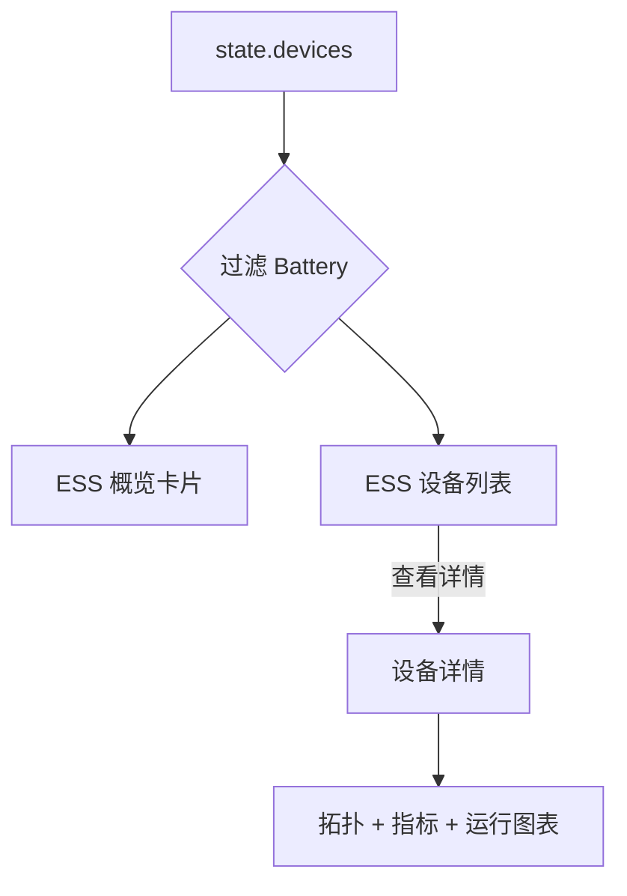

# DER 管理

## 文档控制
- 文档类型: PRD
- 产品领域: DER 管理
- 范围: ESS 子菜单与设备详情
- 版本: 1.0
- 日期: 2026-02-04
- 负责人: TBD

## 执行摘要
DER 管理为分布式能源资源提供运营可视化。ESS 子菜单聚焦电池资产，提供状态概览、设备列表以及设备级详情页，包含拓扑可视化、性能摘要与运行图表。本 PRD 描述已实现的 ESS 页面与设备详情体验。

## 目标
- 提供 ESS 资产的快速总览，包含关键状态与容量指标。
- 支持运营人员定位电池资产并进入设备详情。
- 展示设备级拓扑与运行表现摘要。

## 非目标
- 实时资产控制、调度或交易执行。
- 资产创建、接入或批量编辑。
- 自动化告警或通知。

## 人物角色
- **运营分析师**: 监控资产健康并排查设备表现。
- **资产经理**: 查看设备详情与容量状态用于报告。
- **支持工程师**: 通过设备详情排查连接与状态问题。

## 成功指标
- ESS 概览页面在常规数据量下 2 秒内加载完成。
- 90% 的设备调查从 ESS 列表进入设备详情。
- 已知 SN 的设备定位时间低于 10 秒。

## 信息架构
- 导航路径: Manta → DER 管理 → ESS
- 设备详情路径: Manta → DER 管理 → ESS → 设备详情

## 用户旅程
1. 进入 DER 管理并选择 ESS 子菜单。
2. 查看资产级状态与容量卡片。
3. 在 ESS 列表中定位目标设备。
4. 点击眼睛图标进入设备详情。
5. 查看拓扑、PV 数据、逆变器、电池与运行图表。

## 功能需求

### FR-ESS-01: ESS 概览卡片
- **描述**: 展示资产级计数与性能摘要。
- **行为**:
  - 组合卡展示 ESS 总数与在线/离线/断连数量。
  - 额定功率与 PV 容量卡显示聚合 kW 值。
  - SOC 卡显示平均 SOC 与能量占比（kWh）。
  - 今日发电量卡显示聚合 kWh。
- **数据来源**: `state.devices` 按 `Battery` 类型过滤，数量低于 10 时生成模拟数据。
- **验收标准**:
  - 计数随过滤设备更新。
  - SOC 仅统计电池设备。
- **实现状态**: 已实现。

### FR-ESS-02: ESS 设备列表
- **描述**: 展示 ESS 设备的表格列表。
- **列字段**:
  - 状态、SN、NMI、厂商、州、额定功率、PV 容量、SOC、今日发电量、所属 VPP、操作。
- **行为**:
  - 状态以彩色徽章呈现（在线/离线/断连）。
  - PV 容量由额定功率推导；ESS 显示 “-”。
  - SOC 显示百分比与能量分解。
  - 所属 VPP 通过 `dev.vppId` 从 `state.vpps` 解析。
  - 点击眼睛图标进入对应设备详情。
- **验收标准**:
  - 所有过滤设备都有对应行。
  - 无设备时显示 “No devices found”。
- **实现状态**: 已实现。

### FR-ESS-03: 搜索输入框
- **描述**: 提供设备搜索输入框。
- **行为**:
  - 列表头部展示搜索输入框。
  - 未实现过滤逻辑。
- **验收标准**:
  - 输入框与搜索图标可见。
- **实现状态**: 仅 UI（无过滤逻辑）。

### FR-ESS-04: 导航与面包屑
- **描述**: 维护 ESS 与设备详情的面包屑一致性。
- **行为**:
  - ESS 面包屑显示 “DER 管理 > ESS”。
  - 设备详情面包屑显示 “DER 管理 > ESS > 设备详情”。
- **验收标准**:
  - 视图切换时面包屑正确渲染。
- **实现状态**: 已实现。

### FR-ESS-05: 设备详情头部
- **描述**: 展示设备基础信息。
- **字段**:
  - 所属 VPP、NMI、州、并网状态。
- **行为**:
  - 并网状态用圆点指示在线/离线。
  - 设备缺失时显示 “Device not found”。
- **验收标准**:
  - 字段缺失时使用兜底值。
- **实现状态**: 已实现。

### FR-ESS-06: 拓扑可视化
- **描述**: 展示带动画流向的拓扑图。
- **元素**:
  - PV 阵列、电池、逆变器、电网、家庭负载。
  - 带动画箭头的 DC 与 AC 连接线。
- **行为**:
  - 仅可视化，不随状态改变流向。
- **验收标准**:
  - 图形与动画正常渲染。
- **实现状态**: 已实现。

### FR-ESS-07: PV 与环保摘要
- **描述**: 展示 PV 数据与环保收益。
- **指标**:
  - PV: 容量、今日发电、今日满发小时、月发电、年发电、累计发电。
  - 环保: CO₂ 减排、植树数量。
- **行为**:
  - 值由设备容量通过固定系数计算。
- **验收标准**:
  - 指标显示正确并与容量计算一致。
- **实现状态**: 已实现。

### FR-ESS-08: 逆变器摘要
- **描述**: 展示逆变器元数据与功率指标。
- **字段**:
  - SN、厂商、型号、类型、额定功率、输入功率、输出功率、运行模式。
- **行为**:
  - 型号缺失时显示 “Unknown”。
  - 输入/输出功率由容量系数推导。
- **验收标准**:
  - 字段正确显示且有兜底值。
- **实现状态**: 已实现。

### FR-ESS-09: 电池摘要
- **描述**: 展示电池元数据与容量状态。
- **字段**:
  - 型号、额定容量、可用充电、可用放电、SOC、SOC 下限。
- **行为**:
  - 值由设备容量通过固定系数计算。
- **验收标准**:
  - 任意 ESS 设备均可显示字段。
- **实现状态**: 已实现。

### FR-ESS-10: 运行图表
- **描述**: 提供含标签与日期控制的运行图表。
- **控件**:
  - 粒度选择（天/月/年/总计）。
  - 日期选择器或年份选择器（随粒度切换）。
  - 前后日期切换按钮。
  - 标签：状态、发电、用电。
- **行为**:
  - 粒度、日期或标签变化时图表刷新。
- **验收标准**:
  - 控件可交互且图表随变化更新。
- **实现状态**: 已实现。

## 数据与计算逻辑
- **设备来源**: `state.devices` 与 `state.vpps`。
- **模拟数据**: 过滤后设备少于 10 时追加模拟设备以保证列表密度。
- **SOC（概览卡）**: 基于电池容量与 SOC 的加权平均。
- **PV 容量（概览）**: 逆变器容量总和 * 1.2。
- **今日发电量（概览）**: 设备容量总和 * 3。
- **列表 SOC**: 未提供时生成，并按额定容量计算能量分解。
- **设备详情指标**: 由设备容量通过固定系数推导。

## 状态与边界情况
- **空列表**: 显示 “No devices found”。
- **设备缺失**: 显示 “Device not found”。
- **VPP 缺失**: 对 VPP 字段显示 “Unassigned” 或 “-”。
- **型号缺失**: 使用 “Unknown”。

## 依赖
- `lucide` 图标库。
- 运行图表渲染模块。
- 全局 `state.devices` 与 `state.vpps` 数据源。

## 可访问性与视觉设计
- 状态使用颜色并配文字说明。
- 图标提升模块识别度。
- 拓扑使用动效但保留静态结构。

## 风险与限制
- 搜索输入框不具备过滤能力。
- 多数指标来自固定系数计算而非实时遥测。
- 数据稀疏时会生成模拟设备。

## 埋点建议
- 统计 ESS 页面访问、筛选类型使用与设备详情打开次数。
- 统计运行图表的标签与粒度切换行为。
