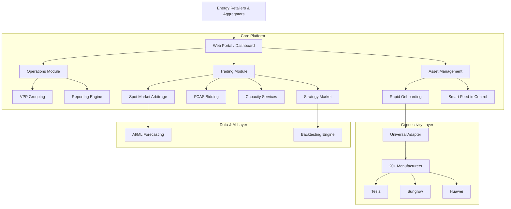
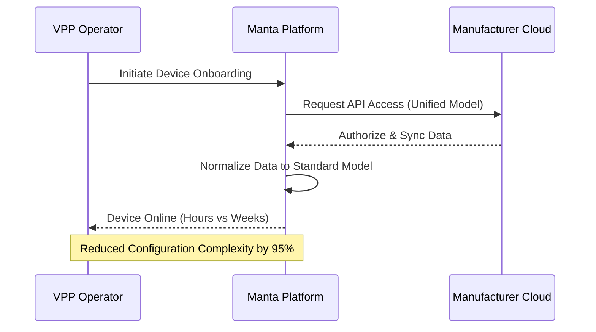

# Manta VPP Platform - Product Requirements Document (PRD)

## 1. Product Overview
**Product Name:** Manta VPP SaaS Platform
**Type:** Enterprise-Grade Virtual Power Plant (VPP) Software as a Service
**Target Audience:** Energy Retailers, Aggregators, Grid Operators
**Core Value Proposition:** Transforming distributed energy resources (DERs) from simple connected assets into intelligent, revenue-generating trading assets.

### 1.1 Mission Statement
To engineer a trading-first VPP platform where intelligence meets execution, enabling customers to scale from asset connectivity to sustainable revenue generation across multiple energy markets.

---

## 2. Market Opportunity & Strategic Context
**Global Market Growth:**
- **2024:** $46B
- **2034:** $322B (Projected)
- **CAGR:** 21.6%

**Key Drivers:**
- Renewable energy proliferation
- Grid flexibility requirements
- Energy market liberalization
- Maturity of AI/ML technologies

---

## 3. Functional Requirements & Core Modules

### 3.1 Revenue Generation Modules
The platform must support three distinct revenue streams:

#### A. Spot Market Arbitrage
- **Functionality:** AI-powered forecasting to buy low and sell high.
- **Key Features:** Real-time price tracking, automated dispatch signals.
- **Financial Impact:** Range from -$1,000 to $20,000/MWh volatility capture.

#### B. FCAS (Frequency Control Ancillary Services)
- **Functionality:** Provide sub-second frequency response to grid operators.
- **Key Features:** Visual bidding interface, status management, compliance reporting.
- **Financial Impact:** +20-30% additional revenue stability.

#### C. Capacity Services
- **Functionality:** Peak shaving to reduce demand charges.
- **Key Features:** Peak prediction, load shedding automation.
- **Financial Impact:** $20,000+ annual savings per customer.

### 3.2 Operational Modules

#### D. VPP Management
- **Requirement:** Rapid equipment grouping into virtual power plants.
- **Goal:** Operational agility for managing diverse asset portfolios.

#### E. Smart Feed-in
- **Requirement:** Dynamic export rules management.
- **Goal:** Negative price protection (curtailment during negative pricing events).

#### F. Strategy Market
- **Requirement:** Marketplace for trading algorithms.
- **Features:** Algorithm backtesting, listing, and real-time yield ranking.

#### G. Reports & Settlement
- **Requirement:** Financial audit-grade reporting.
- **Features:** Customizable fields, exportable formats for settlement.

---

## 4. System Architecture

### 4.1 Functional Architecture Diagram

### 4.2 Data Flow & Onboarding Process

---

## 5. Key Differentiators & Success Metrics

### 5.1 Trading-First Architecture
Every component is optimized for financial performance, not just monitoring.

### 5.2 Rapid Onboarding (Universal Access Solution)
- **Pain Point:** Traditional platforms take weeks; mixed-vendor ecosystems are hard to manage.
- **Solution:** Unified Semantic Model + Pre-integrated drivers.
- **Metric:** Onboarding time reduced from **Weeks** to **Hours**.
- **Metric:** Configuration complexity reduced by **95%**.
- **Coverage:** 20+ Pre-integrated manufacturers (Tesla, Sungrow, SMA, GoodWe, etc.).

### 5.3 Flexible Strategy Configuration
- **Pain Point:** Hard-coded strategies require code deployment ("Blind Flight").
- **Solution:** Configurable strategy parameters without code changes.

---

## 6. User Interface Requirements
- **Design Style:** Glassmorphism (Translucent layers, blur effects).
- **Theme:** Dark Mode default (Enterprise/Trading feel).
- **Color Palette:** Emerald Green (Growth/Sustainability), Blue (Tech/Stability), Purple (Premium/AI).
- **Responsiveness:** Fully responsive for desktop and tablet operation.
