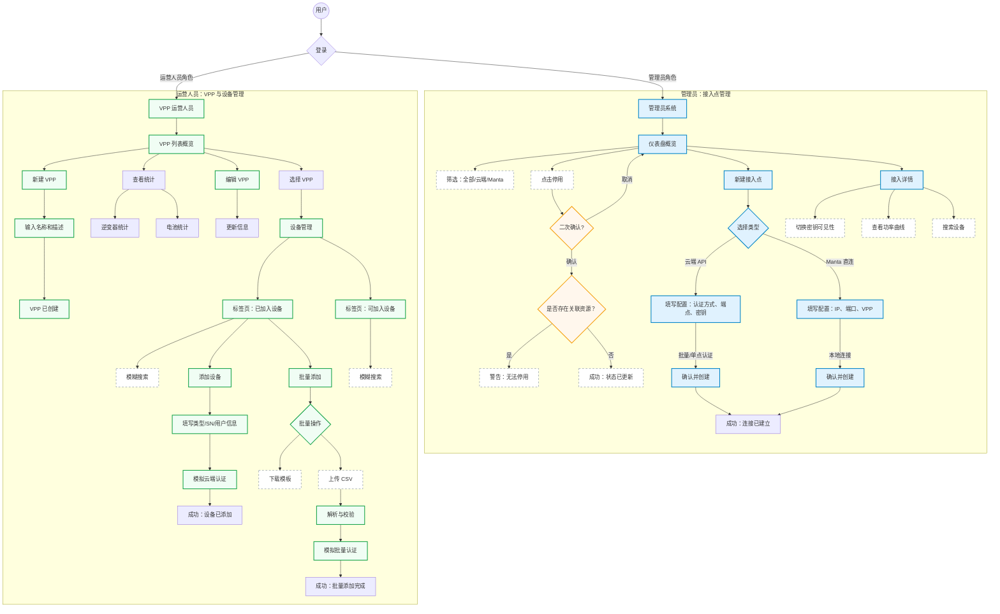

# Manta VPP 系统流程图

```mermaid
graph TD
    %% 角色
    User((用户))
    Admin[管理员系统]
    Operator[VPP 运营人员]

    %% 主入口
    User --> Login{登录}
    Login -->|管理员角色| Admin
    Login -->|运营人员角色| Operator

    %% 管理员流程 - 数据接入
    subgraph Admin_Data_Access [管理员：接入点管理]
        direction TB
        Admin --> Dashboard[仪表盘概览]
        
        %% 仪表盘操作
        Dashboard --> Filter[筛选：全部/云端/Manta]
        
        %% 切换状态与依赖检查
        Dashboard --> ToggleStatus[点击停用]
        ToggleStatus --> ConfirmDisable{二次确认?}
        ConfirmDisable -->|取消| Dashboard
        ConfirmDisable -->|确认| CheckDep{是否存在关联资源？}
        CheckDep -->|是| ShowAlert[警告：无法停用]
        CheckDep -->|否| UpdateStatus[成功：状态已更新]
        
        Dashboard --> CreateAccess[新建接入点]
        
        %% 新建接入流程
        CreateAccess --> SelectType{选择类型}
        
        %% Cloud 流程
        SelectType -->|云端 API| CloudForm[填写配置：认证方式、端点、密钥]
        CloudForm -->|批量/单点认证| SubmitCloud[确认并创建]
        
        %% Manta 流程
        SelectType -->|Manta 直连| MantaForm[填写配置：IP、端口、VPP]
        MantaForm -->|本地连接| SubmitManta[确认并创建]
        
        SubmitCloud --> SuccessAccess[成功：连接已建立]
        SubmitManta --> SuccessAccess
        
        %% 查看详情
        Dashboard --> ViewDetails[接入详情]
        ViewDetails --> RevealSecret[切换密钥可见性]
        ViewDetails --> ViewChart[查看功率曲线]
        ViewDetails --> SearchAdminDev[搜索设备]
    end

    %% 运营人员流程 - VPP 管理
    subgraph VPP_Management [运营人员：VPP 与设备管理]
        direction TB
        Operator --> VPPList[VPP 列表概览]
        
        %% VPP 操作
        VPPList --> CreateVPP[新建 VPP]
        CreateVPP --> VPPForm[输入名称和描述]
        VPPForm --> SubmitVPP[VPP 已创建]
        
        VPPList --> ViewStats[查看统计]
        ViewStats --> InverterStats[逆变器统计]
        ViewStats --> BatteryStats[电池统计]
        
        VPPList --> EditVPP[编辑 VPP]
        EditVPP --> UpdateVPP[更新信息]
        
        %% 设备分配流程
        VPPList --> SelectVPP[选择 VPP]
        SelectVPP --> ManageDevices[设备管理]
        
        %% 标签页：已加入设备
        ManageDevices --> JoinedTab[标签页：已加入设备]
        JoinedTab --> SearchJoined[模糊搜索]
        
        %% 手动添加设备
        JoinedTab --> AddDevice[添加设备]
        AddDevice --> AddForm[填写类型/SN/用户信息]
        AddForm --> SubmitAdd[模拟云端认证]
        SubmitAdd --> AddSuccess[成功：设备已添加]
        
        %% 批量添加设备
        JoinedTab --> BatchAdd[批量添加]
        BatchAdd --> BatchModal{批量操作}
        BatchModal --> DownloadTpl[下载模板]
        BatchModal --> UploadCSV[上传 CSV]
        UploadCSV --> ProcessBatch[解析与校验]
        ProcessBatch --> BatchAuth[模拟批量认证]
        BatchAuth --> BatchSuccess[成功：批量添加完成]
        
        %% 标签页：可加入设备 (发现)
        ManageDevices --> DiscoveryTab[标签页：可加入设备]
        DiscoveryTab --> SearchDiscover[模糊搜索]
    end

    %% 样式
    classDef admin fill:#e0f2fe,stroke:#0284c7,stroke-width:2px;
    classDef vpp fill:#f0fdf4,stroke:#16a34a,stroke-width:2px;
    classDef action fill:#fff,stroke:#64748b,stroke-width:1px,stroke-dasharray: 5 5;
    classDef logic fill:#fff7ed,stroke:#f59e0b,stroke-width:2px;
    
    class Admin,Dashboard,CreateAccess,SelectType,CloudForm,MantaForm,SubmitCloud,SubmitManta,ViewDetails admin;
    class Operator,VPPList,CreateVPP,VPPForm,SubmitVPP,EditVPP,ManageDevices,JoinedTab,DiscoveryTab,AddDevice,AddForm,SubmitAdd,BatchAdd,BatchModal,ProcessBatch,BatchAuth vpp;
    class Filter,ToggleStatus,RevealSecret,ViewChart,SearchAdminDev,SearchJoined,SearchDiscover,DownloadTpl,UploadCSV,ShowAlert,UpdateStatus action;
    class CheckDep,ConfirmDisable logic;
```
